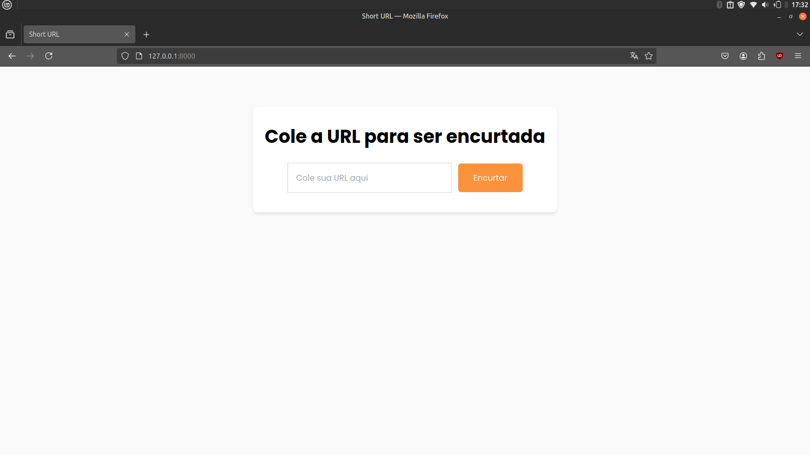

# Short URL

This project is a simple URL shortener using Flask for the back-end and Tailwind CSS for the front-end.



## Setup Guide

## Clone

```
git clone https://github.com/jcoffeex/short-url.git
cd short-url
```

## Create an environment

```
python3 -m venv .venv
```

## Activate the environment

```
 . .venv/bin/activate
```

## Install dependencies

```
pip install -r requirements.txt
```

## server run

- By running the start.sh script:

```
./start.sh
```

- Using Gunicorn:

```
gunicorn run:app
```

- Running directly with Python:

```
python run.py
```

## Note:

Make sure to change the api to work normally. If you use: ` python run.py` don't forget to put `app.run(debug=True)` in `run.py`

## Run Tailwind CSS

```
npx tailwindcss -i ./app/static/css/input.css -o ./app/static/css/output.css --watch
```

## Deployment

Slow due to free service.

https://short-url-dp9s.onrender.com/

## Video

<a href='https://fqvdbgearwiwcebrpbop.supabase.co/storage/v1/object/public/file/short-url.mp4'>Video link<a/>
